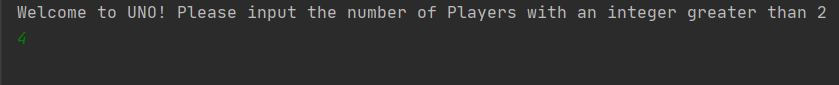
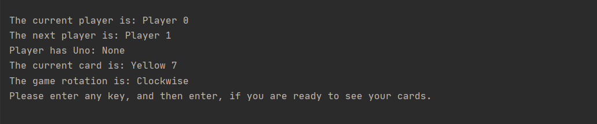

**Manual Test Plan**

**IDE** 
Intellij Community v2020.2 
Eclipse v4.16 

**Start Game** 
After beginning the game, you will be greeted by the opening statement and then asked to input 
a number of players. 
 
Make sure to input an integer.

**Player's Turn** 
After the game has started the first player will be told to initiate their turn.
When it is your a turn to play you will be prompted as such, 
 
In this Uno game, you may put more than one card onto the discard deck at a time
as long as the cards match the color or value of the card most recently played by the previous player
 
 
In the case you do not have any valid cards to play, you will be prompted as such. 
 
When you do not have any cards to play, the player has to keep taking cards until a playable card is drawn.
This completes your turn, and is now the next players turn.
 
 

If you play an invalid card you will get a message as such, 
 
 
 

When you play a card from your hand you will be prompted as such,  
 
If you play two cards, you will see this message instead 
 

When it is the next players turn, the console will no longer show the previous players hand.
For this reason, make sure to keep the console at a medium length, only enough to see the longest prompt of 10 lines.

**End Game** 
When there is a player with no cards left the game will be over.
You will see a message as such, 

